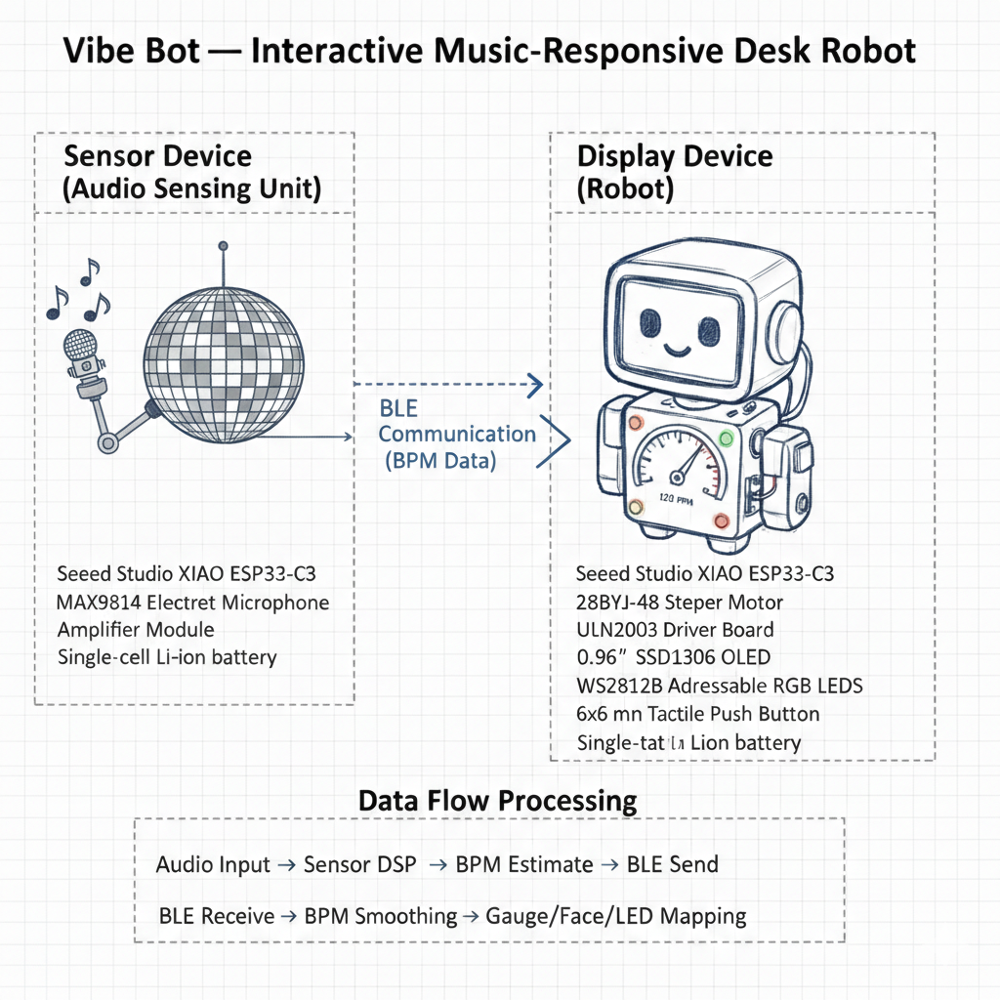
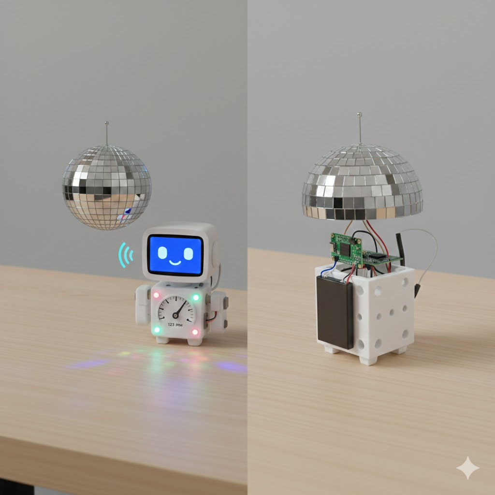
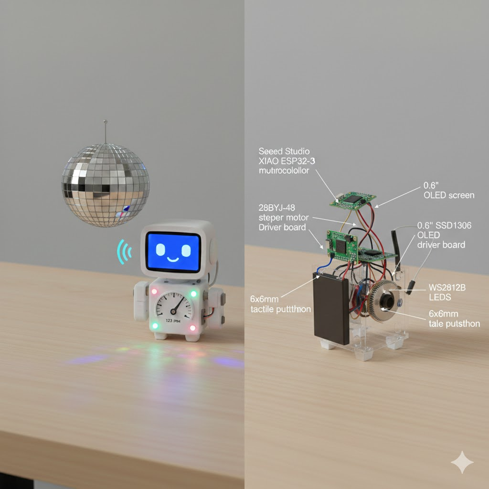
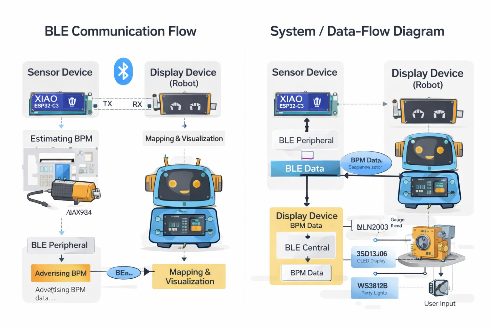

# Vibe Bot – Interactive Music-Responsive Desk Robot

Vibe Bot is a wireless, music-responsive desk robot that senses ambient audio to estimate the tempo (BPM) of music and visualizes it through a mechanical gauge, animated facial display, and dynamic lighting. The system consists of a separate sensing device and display device that communicate wirelessly.

## Sensor Device (Audio Sensing Unit)

The sensor device is a compact, battery-powered module placed near the music source. It uses a microphone to capture ambient audio, runs DSP to estimate BPM, and transmits BPM data wirelessly to the display device.

Parts (sensor device):
- Microcontroller: Seeed Studio XIAO ESP32-C3 (ESP32-C3)
- Microphone: INMP441 (I2S MEMS microphone) 

## Display Device (Robot)

The display device is a 3D-printed desktop robot that receives BPM data and visualizes it using a stepper-motor gauge needle, at least one LED, and a button for interaction (mode selection / calibration). The face is shown using an OLED display, and the LEDs provide "party lights" effects.

Parts (display device):
- Microcontroller: Seeed Studio XIAO ESP32-C3 (ESP32-C3)
- Stepper motor: 28BYJ-48
- Stepper driver: ULN2003 driver board 
- OLED: 0.96" SSD1306 I2C OLED
- LEDs: WS2812B addressable LEDs
- Button: 6x6mm tactile pushbutton

## Communication and Data Flow

The sensor device estimates BPM from audio and sends BPM (and optional confidence) over BLE to the display device. The display device smooths incoming BPM values and maps them to gauge needle position, facial animation states, and LED patterns.

## Datasheets

All component datasheets are available in the `datasheets/` folder, including:
- ESP32-C3 microcontroller
- MAX9814 microphone amplifier
- SSD1306 OLED display
- WS2812B RGB LEDs
- 28BYJ-48 stepper motor
- ULN2003 stepper driver

### Selected Components (Final)

Sensor Device:
- Microcontroller: Seeed Studio XIAO ESP32-C3
- Microphone: MAX9814 Electret Microphone Amplifier Module
- Power: Single-cell Li-ion battery

Display Device:
- Microcontroller: Seeed Studio XIAO ESP32-C3
- Stepper Motor: 28BYJ-48
- Stepper Driver: ULN2003
- Display: 0.96" SSD1306 OLED (I2C)
- LEDs: WS2812B addressable RGB LEDs
- User Input: 6x6 mm tactile push button
- Power: Single-cell Li-ion battery with onboard regulation
